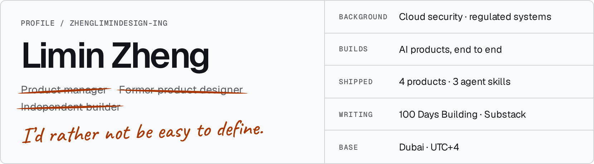
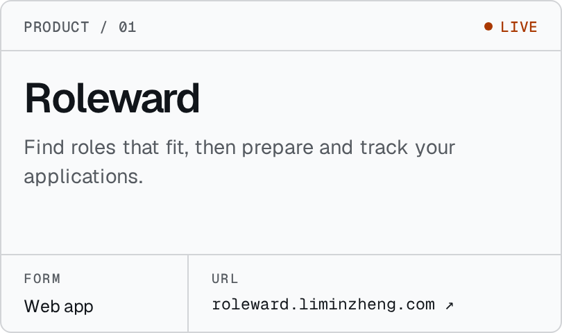
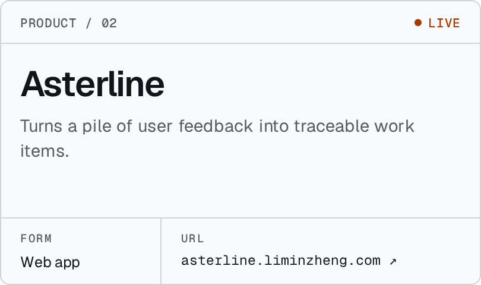
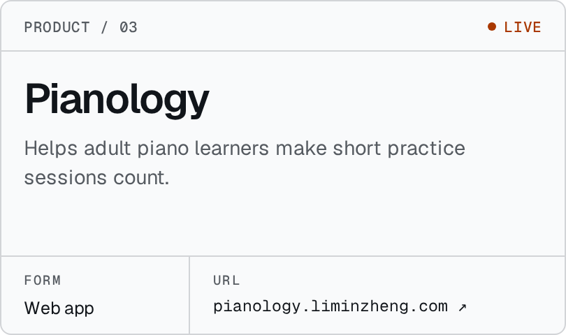
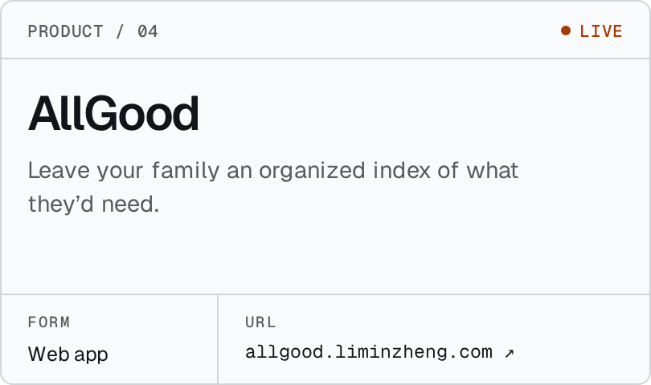
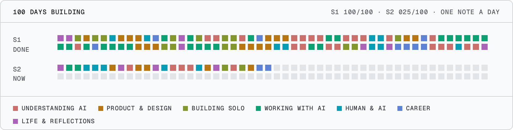

<picture><source media="(prefers-color-scheme: dark)" srcset="assets/header-dark.png"></picture>

I build AI products end to end. Before that: B2B platforms, cloud security, and regulated digital-asset infrastructure.

### Products

  <a href="https://roleward.liminzheng.com"><picture><source media="(prefers-color-scheme: dark)" srcset="assets/card-roleward-dark.png"></picture></a>
  <a href="https://asterline.liminzheng.com"><picture><source media="(prefers-color-scheme: dark)" srcset="assets/card-asterline-dark.png"></picture></a>
  <a href="https://pianology.liminzheng.com"><picture><source media="(prefers-color-scheme: dark)" srcset="assets/card-pianology-dark.png"></picture></a>
  <a href="https://allgood.liminzheng.com"><picture><source media="(prefers-color-scheme: dark)" srcset="assets/card-allgood-dark.png"></picture></a>

Case studies: [Roleward](https://roleward.liminzheng.com/case-study) · [Asterline](https://github.com/zhenglimindesign-ing/asterline/blob/main/CASE-STUDY.md)

Experiment: [Voice Interview Lab](https://roleward.liminzheng.com/interview-lab) *(private, owner-only)*

### Open-source agent skills

| Skill | What it does | Status |
|---|---|---|
| [Roleward Job Hunting](https://github.com/zhenglimindesign-ing/roleward-job-hunting) | Decide which roles deserve attention, then prepare truthful application materials. | Public alpha · Codex |
| [Reflection Companion](https://github.com/zhenglimindesign-ing/reflection-companion) | Turns your AI conversations into diaries, weekly reviews and questioned assumptions. | Alpha · v0.5.6 |
| [Score Simplifier](https://github.com/zhenglimindesign-ing/piano-score-simplifier) | Easier solo-piano arrangements from a reliable source score. PDF, MusicXML, MIDI. | Alpha · v0.3.7 |

### Building in public

<a href="https://100days.liminzheng.com/en"><picture><source media="(prefers-color-scheme: dark)" srcset="assets/100days-dark.png"></picture></a>

One note a day on [100 Days Building](https://100days.liminzheng.com/en). Longer essays on [Substack](https://liminzheng.substack.com/).

<b>Selected product notes</b> · English / 中文

- **[AI Cost Is a Product Architecture Problem](notes/ai-cost-is-a-product-architecture-problem.md)** · [中文](notes/ai-cost-is-a-product-architecture-problem.zh-CN.md)
- **[Model + Harness + Product](notes/model-harness-product.md)** · [中文](notes/model-harness-product.zh-CN.md)
- **[What PMs Should—and Shouldn't—Delegate to AI](notes/what-product-managers-should-not-delegate-to-ai.md)** · [中文](notes/what-product-managers-should-not-delegate-to-ai.zh-CN.md)
- **[From Linear Handoffs to Spiral Building](notes/from-linear-handoffs-to-spiral-building-with-ai.md)** · [中文](notes/from-linear-handoffs-to-spiral-building-with-ai.zh-CN.md)

[liminzheng.com](https://liminzheng.com) · [LinkedIn](https://www.linkedin.com/in/limin-zheng) · [Substack](https://liminzheng.substack.com/) · [X](https://x.com/Limin__Zheng) · zhenglimin.design@gmail.com
